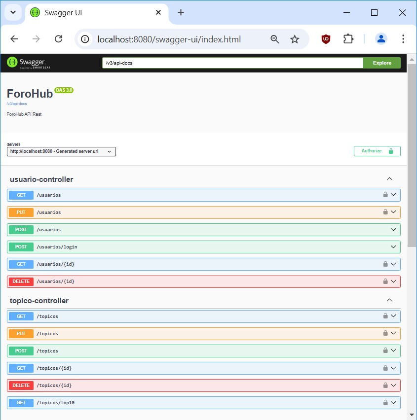
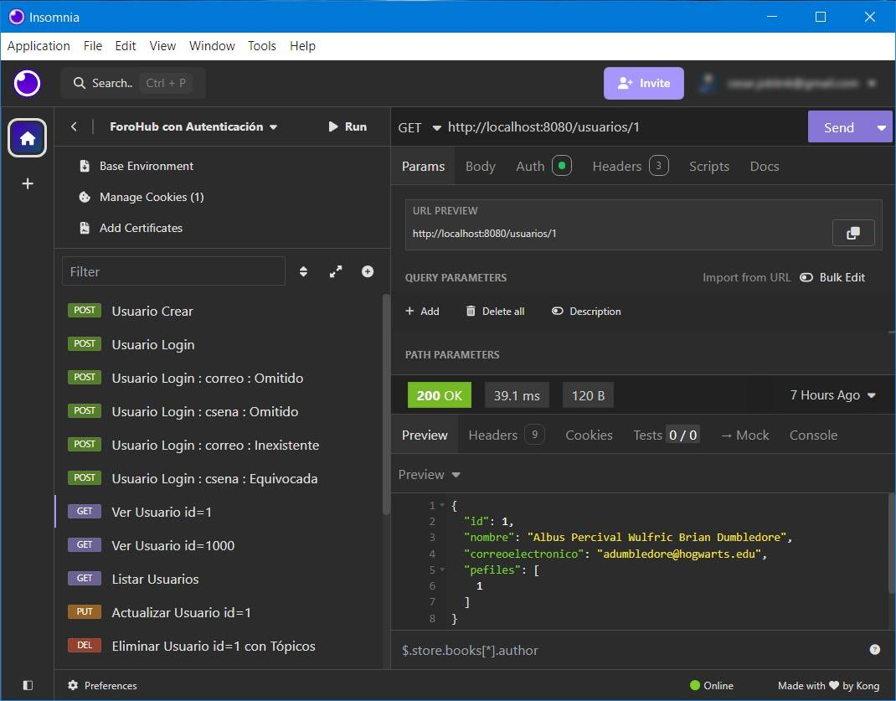

<h1 align="center">ForoHub</h1>

 

## Índice de Contenidos:
---
- [Contexto](#contexto)
- [Guía de Usuario](#guía-de-usuario)
- [Guía de Instalación](#guía-de-instalación)
- [Autor](#autor)
- [Licencia](#licencia)
- [Agradecimientos](#agradecimientos)
- [Documentos Complementarios](#documentos-complementarios)

## Contexto
---

ForoHub es una aplicación desarrollada en Java con el entorno IntelliJ para el desafío del curso &quot;Practicando Spring Framework: Challenge Foro Hub&quot; de ONE + Alura Latam. Ha sido manufacturada por su autor (con asistencia de IA) en Noviembre de 2024.

&#8593; <a href="#readme-indice">Índice</a> &#8593; <a href="#readme-inicio">Inicio</a> &#8593;

## Guía de Usuario
---
Esta aplicación es una API REST que implementa parcialmente la funcionalidad de un foro.

Se encuentran completos los CRUDs en relación a <code>topico</code> (desafío obligatorio) y <code>usuario</code> (desafío optativo).

Como provee una interfaz amigable gracias al uso de SpringDoc-Swagger (desafío optativo) es fácilmente accesible con un enlace similar al siguiente:

http://localhost:8080/swagger-ui/index.html

(De todos modos, se provee un conjunto de requests en un archivo importable desde Insomnia).

Vale destacar que el servicio de autenticación se basa en Auth0-JWT, y que las contraseñas de los usuarios son almacenadas previa encriptación con Bcrypt.

Respecto de la BBDD, es posible hacer el seguimiento de su desarrollo a través de las sucesivas migraciones de Flyway.
    
A continuación, unas muestras de las interfaces utilizando SpringDoc-Swagger e Insomnia:

<table align="center" style="border:0">
<tr>
<td align="left"></td>
<td align="left"></td>
</tr>
</table>

&#8593; <a href="#readme-indice">Índice</a> &#8593; <a href="#readme-inicio">Inicio</a> &#8593;

## Guía de Instalación
---
Simplemente se requiere clonar este proyecto en el repositorio local, y luego ejecutarlo con un IDE acorde (como IntelliJ, Eclipse, etc) desde el método <code>main</code> de la clase <code>ForoHubApplication</code>.

Dado que la aplicación trabaja con una base de datos, se requiere un servidor MySQL 8.0.40 o superior previamente instalado. (Se proveen scripts SQL para pruebas).

Importante: No olvidar declarar las variables de entorno que se utilizan en <code>application.properties</code>.

&#8593; <a href="#readme-indice">Índice</a> &#8593; <a href="#readme-inicio">Inicio</a> &#8593;

## Autor
---
César es alumno de Alura. Inició su formación en Junio de 2024 dentro del plan Oracle Next Education para Latinoamérica. Tiene 55 años y es nacido en Buenos Aires.

&#8593; <a href="#readme-indice">Índice</a> &#8593; <a href="#readme-inicio">Inicio</a> &#8593;

## Licencia 
---
Licencia BSD Zero Clause (0BSD) detallada en <code>LICENSE.txt</code> en la raíz del repositorio. Más información en https://opensource.org/license/0bsd

&#8593; <a href="#readme-indice">Índice</a> &#8593; <a href="#readme-inicio">Inicio</a> &#8593;

## Agradecimientos 
---
* Generador de logotipo : https://chatgpt.com
* Generador de favicon : https://favicon.io

&#8593; <a href="#readme-indice">Índice</a> &#8593; <a href="#readme-inicio">Inicio</a> &#8593;

## Documentos Complementarios
---
* Clonar un repositorio de GitHub : https://docs.github.com/es/repositories/creating-and-managing-repositories/cloning-a-repository
* Scripts SQL para pruebas : https://github.com/cesargh/forohub/tree/master/sql
* Requests de Insomnia : https://github.com/cesargh/forohub/tree/master/insomnia

&#8593; <a href="#readme-indice">Índice</a> &#8593; <a href="#readme-inicio">Inicio</a> &#8593;

